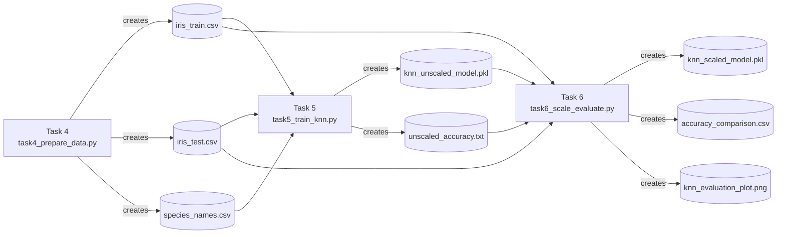
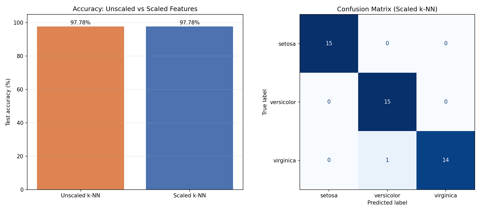

<div align="center">

# 🌸 Flower Classifier (Iris k-NN)

A beginner-friendly machine learning project that classifies iris flowers into three species — **setosa**, **versicolor**, and **virginica** — based on their petal and sepal measurements, using **k-Nearest Neighbors (k-NN)**.

Built as part of an internship task at **SoftNexis**.

[](https://www.python.org/)
[](https://pandas.pydata.org/)
[](https://numpy.org/)
[](https://scikit-learn.org/)
[](https://matplotlib.org/)

</div>

---

## 📝 Overview

This project is split into three connected scripts that mirror a real ML workflow:

| Step | Script | What it does |
|------|--------|----------------|
| 4️⃣ | `task4_prepare_data.py` | Loads the Iris dataset, explores it, and splits it into training (70%) and testing (30%) sets |
| 5️⃣ | `task5_train_knn.py` | Trains a k-NN classifier (k=3) on the raw, unscaled measurements and checks its accuracy |
| 6️⃣ | `task6_scale_evaluate.py` | Scales the features with `MinMaxScaler`, retrains k-NN, compares accuracy against Task 5, and produces a classification report, confusion matrix, and comparison plot |

> [!IMPORTANT]
> Each script saves its output to a file that later scripts load — so they must be run **in order**, in the same folder. Using the *same* train/test split across all three tasks keeps the accuracy comparison in Task 6 fair.



---

## 📓 Jupyter Notebook

An interactive, step-by-step Jupyter Notebook is available to run and explore the entire machine learning workflow in one place:
* **[Project_2_Flower_Classifier.ipynb](./Project_2_Flower_Classifier.ipynb)**

This notebook combines the dataset generation, k-NN model training (unscaled and scaled), metrics analysis, and the comparison plots with interactive code blocks and inline outputs.

---

## 📁 Directory Structure

```
Flower_Classifier/
├── Project_2_Flower_Classifier.ipynb  # Interactive Jupyter Notebook
├── task4_prepare_data.py              # Step 1: Load, explore & split the Iris dataset
├── task5_train_knn.py                 # Step 2: Train k-NN on unscaled features
├── task6_scale_evaluate.py            # Step 3: Scale features, retrain, evaluate & plot
├── requirements.txt                   # Python dependencies
└── README.md                          # You are here
```

**Generated files** (created automatically when you run the scripts — not stored in the repo):

| File | Created by | Used by |
|------|-----------|---------|
| `iris_train.csv` / `iris_test.csv` / `species_names.csv` | Task 4 | Task 5, Task 6 |
| `knn_unscaled_model.pkl` / `unscaled_accuracy.txt` | Task 5 | Task 6 |
| `knn_unscaled_predictions.csv` | Task 5 | — |
| `knn_scaled_model.pkl` / `feature_scaler.pkl` | Task 6 | — |
| `accuracy_comparison.csv` | Task 6 | — |
| `knn_evaluation_plot.png` | Task 6 | — |

---

## 🚀 Quick Start & Setup

**1. Clone the repository**
```bash
git clone https://github.com/dhanish0711/flower-classifier.git
cd Flower_Classifier
```

**2. (Optional) Create a virtual environment**
```bash
python -m venv venv
source venv/bin/activate      # On Windows: venv\Scripts\activate
```

**3. Install dependencies**
```bash
pip install -r requirements.txt
```

---

## 🏃 How to Run

Run the three scripts **in order** — each one depends on the file(s) saved by the previous step(s):

```bash
python task4_prepare_data.py
python task5_train_knn.py
python task6_scale_evaluate.py
```

> [!TIP]
> You can also run everything in Google Colab — just upload the three `.py` files (or copy each one into its own cell) and run them top to bottom. (`sklearn.datasets.load_iris()` works out of the box, no external dataset needed.)

---

## 📊 Results & Visualizations

The k-Nearest Neighbors classifier achieved identical, high-accuracy results on both unscaled and scaled datasets:

| Dataset Version | Accuracy |
| :--- | :---: |
| **Baseline (Unscaled Features)** | **97.78%** |
| **New (Scaled Features)** | **97.78%** |

### 📈 Detailed Classification Metrics (Scaled Model)

| Species | Precision | Recall | F1-Score | Support |
| :--- | :---: | :---: | :---: | :---: |
| 🌸 **Setosa** | 1.00 | 1.00 | 1.00 | 15 |
| 🌸 **Versicolor** | 0.94 | 1.00 | 0.97 | 15 |
| 🌸 **Virginica** | 1.00 | 0.93 | 0.97 | 15 |
| **Overall Accuracy** | | | **0.98** | **45** |

### 🔲 Confusion Matrix

| Actual \ Predicted | Setosa | Versicolor | Virginica |
| :--- | :---: | :---: | :---: |
| **Setosa** | **15** | 0 | 0 |
| **Versicolor** | 0 | **15** | 0 |
| **Virginica** | 0 | 1 | **14** |

### 📉 Model Evaluation Plot

The plot below displays the accuracy comparison bar chart alongside a heatmap of the confusion matrix:



#### 🤔 Why did scaled and unscaled accuracy come out the same (97.78%)?

This isn't a bug — it's expected for this dataset. `MinMaxScaler` rescales each feature with a simple linear formula:
```
scaled_value = (value - min) / (max - min)
```
That only stretches or shrinks each feature's axis by a constant factor; it never changes the *order* of which points are near or far from each other along that axis. So scaling only changes k-NN's predictions when one feature's raw range is much larger than the others and is dominating the distance calculation.

In the Iris dataset, all four measurements happen to live in a similar range (roughly 0–8 cm):

| Feature | Range (training set) |
|---|---|
| sepal length | ~3.6 cm |
| sepal width | ~2.2 cm |
| petal length | ~5.9 cm |
| petal width | ~2.4 cm |

No feature dominates, so rescaling doesn't reorder anyone's nearest neighbors — both models pick the exact same 3 neighbors for every test flower, and produce identical predictions and accuracy.

**The takeaway:** feature scaling is a "fix when needed," not something that always changes results. It matters most when features are on very different scales — for example, if you added a feature like "petal weight in grams" (range 0–5000) next to "petal width in cm" (range 0.1–2.5), the gram values would dominate the unscaled distance calculation, and scaling would then make a real, measurable difference.

---

## 📚 Key Machine Learning Concepts

- **Dataset Handling**: Loading a built-in dataset with `scikit-learn`.
- **Stratified Splitting**: Splitting train/test sets while preserving species distribution class balance.
- **k-Nearest Neighbors (k-NN)**: Distance-based classification algorithm.
- **Feature Scaling**: Rescaling features using `MinMaxScaler` and analyzing its effect on distance calculations.
- **Model Evaluation**: Metrics including accuracy, precision, recall, f1-score, and confusion matrix.
- **Model Persistence**: Saving/loading trained models and scalers using `joblib`.
- **Data Visualization**: Heatmaps and bar charts using `matplotlib`.

---

Made with ❤️ by [Dhanish Ladwani](https://github.com/dhanish0711)
